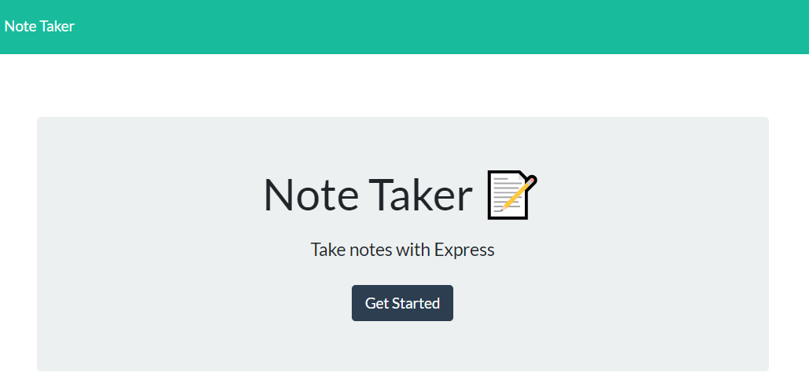

# note-taker

## Description 

### [Deployed Link](https://notetakingapplication11.herokuapp.com/)

This is an application to take notes/reminders on a webpage utilizing express. 

We utilize .use, .get, .post, and .delete to handle routing, data persistence, and data management.

## Table of Contents

* [Installation](#installation)
* [Usage](#usage)
* [Credits](#credits)
* [License](#license)


## Installation

Use deployed link above, or clone/fork repository and run on local machine

To install necessary dependencies, run the following command:
```
npm i
```

## Usage 

To start, click on deployed link, or if cloned repository, run the following command and access localhost 3001 port:
```
node server.js
```
You will be directed to a landing page:



Click get started, and you will be brought to the note taking page to save new  notes or view previously saved notes.


## Credits

[fs](https://notetakingapplication11.herokuapp.com/)

[Express](https://expressjs.com/)

[npm](https://www.npmjs.com/)

[Node](https://nodejs.org/en/docs/)

[Heroku](https://notetakingapplication11.herokuapp.com/)

[Matt](https://github.com/fiaschettima)

## License

[](https://opensource.org/licenses/MIT)

 This project is licensed under the MIT license.